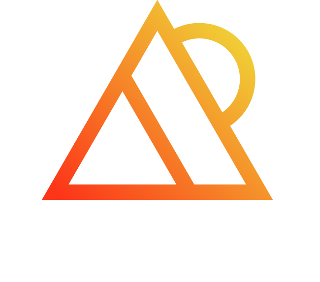

## **Hi there, I'm Edi!** 🐬

 

<!-- LIST-ACTIVITIES:START -->

-  Technology Evangelist at Percona
- 🇬🇧 UK Global Talent Visa Recipient
- [CNCF Ambassador](https://www.cncf.io/people/ambassadors/)
- [Docker Captain](https://www.docker.com/community/captains/)👩‍✈️ 🐳
- Women Techmakers Ambassador 👩‍💻
-  intern for Apache Airflow 2021 
- 🔭 Training in **Data Structures and Algorithms** and **System Design** [LeetCode Profile](https://leetcode.com/Edithturn/)
- 👾 Getting more involved [Kubernetes for Developers](https://github.com/edithturn/CKAD-training)
-  Silicon Valley student 2020
- 🏀 I like to play basketball
- 💬 Ask me about:
  **Linux, DevOps, Cloud, Docker, Kubernetes, C, Python, Kubernetes Operators**.
        

- Always happy to help 🙇, especially if you are trying something new!

<!--LIST-ACTIVITIES:END -->

### Feel free to conect with me:  &nbsp;  &nbsp;

<!--LIST-YOUTUBE:START -->

### 📺 Latest YouTube Videos 

- [Docker init with Rust](https://youtu.be/X3mK51lZuGA)
- [kubernetes Architecture Explained in 03 minutes](https://youtu.be/CLD0ltIfvW0)
- [Docker init with Python](https://youtu.be/_31-YKg59Ro)
- [Install Docker Desktop on Linux (Ubuntu 20.04)](https://youtu.be/rGq4vYrtHSY)
- [Using GUI For Debug Your Code With LLDB](https://www.youtube.com/watch?v=2Yw1chhv7UQ)
- [Docker in 05 Minutes](https://www.youtube.com/watch?v=cxCG0cFgsd4)
- [Elementary GitHub Readme](https://www.youtube.com/watch?v=4Bh3JEjFr3w&t=26s)

 <!--LIST-YOUTUBE:END -->

<!--LIST-BLOGS:START -->

### 🌱🌱 Latest Blog Posts :art:

<!-- BLOG-POST-LIST:START -->

- [My first Kubecon became the trigger to excel in my professional career!](https://dev.to/edithpuclla/my-first-kubecon-became-the-trigger-to-excel-in-my-professional-career-5a9n)
- [I finally got the job! :')](https://dev.to/edithpuclla/i-finally-got-the-job--928)
- [My experience to become Outreachy Intern for Apache Airflow](https://dev.to/edithpuclla/my-experience-to-become-outreachy-intern-for-apache-airflow-48e6)
- [My first blog as Outreachy Intern! ¨Core Values](https://dev.to/edithpuclla/my-first-blog-as-outreachy-intern-core-values-a0)
- [My Piscine at 42 Silicon Valley California](https://medium.com/@edithpuclla/my-piscine-at-42-silicon-valley-ef662227ed6c)
- [A brief and simple introduction to GPGPU](https://medium.com/katsuhi-code/a-brief-and-simple-introduction-to-gpgpu-fdb43637fff6)

<!--LIST-BLOGS:END -->

<!--HACKTOBERFEST START -->

### Hacktoberfest Badges 2022

<!--HACKTOBERFEST END -->

 

 
